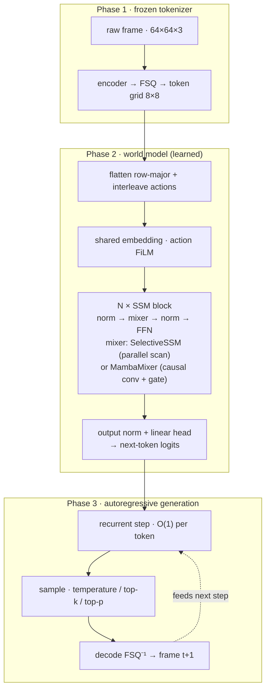

# continuum

**A from-scratch Mamba world model for game simulation.** No game engine runs
underneath — a neural network *is* the engine. Give it a starting frame and a
stream of controller actions, and it generates the future frame by frame:
tokenize the screen, predict the next screen with a selective state-space model,
decode back to pixels, repeat. Because the model is a linear-time SSM rather
than a Transformer, generation cost is constant per token — the design target is
a real-time, playable neural world.

> Status: research-in-progress, built in explicit stages. Every design fork is
> derived in `docs/` and pinned by a load-bearing test before the next stage
> starts.

<!-- TODO: drop a looping GIF of a keyboard-controlled rollout here. -->

## How it works



- **Tokenizer (Phase 1).** A convolutional encoder + **FSQ** (finite scalar
  quantization — no codebook collapse) maps each 64×64 frame to an 8×8 grid of
  discrete tokens. Frozen before Phase 2; the world model never sees pixels.
- **World model (Phase 2).** Frames are flattened row-major into one token
  stream with actions interleaved between them. A stack of selective-SSM blocks
  predicts the next token; the loss scores visual tokens only.
- **Generation (Phase 3).** The same recurrence runs one token at a time with a
  carried state — O(1) per token — which is what makes real-time rollout
  feasible.

## Architecture notes

- **Selective SSM** with input-dependent `Δ`, `B`, `C` (Mamba-style), computed
  two equivalent ways behind one interface: a **parallel associative scan**
  (Hillis-Steele, log-depth) for training and a **recurrent step** for
  generation, both validated against a fully-explicit reference.
- **True Mamba block** (`mixer: mamba`): depthwise **causal** conv → SiLU →
  selective SSM → SiLU gate → projection. The short conv captures local frame
  structure the bare SSM misses.
- **Anti-drift training** (`context_noise_prob`): visual context tokens are
  randomly corrupted during training so the model learns to recover from its own
  imperfect predictions at generation time. Targets are never corrupted.
- **Action conditioning.** `inline` rides the token stream; `film` additionally
  modulates every position of the frame an action governs.
- **Truncated sampling** (temperature / top-k / top-p) curbs the rare
  low-probability tokens that seed drift.

## Results

Additive ablation on grid2d (movement-biased policy, ~44% unique frames), FSQ
tokenizer (vocab 64, 37.8 dB reconstruction), 0.84M-param model, 4000 steps per
arm. Rollout metrics are a 24-frame greedy free-running rollout (token accuracy
vs ground truth, 6 episodes). Reproduce with `scripts/run_ablation.py`.

| arm | ce loss ↓ | teacher-forced acc ↑ | rollout acc mean ↑ | rollout acc @24f ↑ |
| --- | ---: | ---: | ---: | ---: |
| baseline (ssm) | 1.605 | 60.2% | 22.6% | 20.6% |
| + mamba block | 0.842 | 79.8% | 21.8% | 20.6% |
| + film actions | 0.844 | 79.8% | 24.3% | 27.3% |
| + noise aug (full) | 1.030 | 74.4% | **29.5%** | 27.3% |

**The finding: teacher-forced accuracy is a misleading proxy for generation
quality, and noise augmentation is what makes a sharp SSM usable as a world
model.** The mamba block dominates one-step prediction (+20 pts) but gains
nothing in free-running rollout — a textbook exposure-bias signature. Only once
the training context is corrupted (teaching the model to recover from its own
mistakes) does rollout accuracy jump, to 29.5%, despite that arm having the
*lowest* teacher-forced accuracy of the mamba variants. FiLM's benefit is
likewise rollout stability, invisible to one-step metrics. Absolute numbers are
low by design (small model, hard greedy rollout, 64-code tokenizer) — the signal
is the *relative* ordering, stable across batch sizes.

## Quickstart

```bash
cd app/engine
python -m venv .venv && source .venv/bin/activate   # Python 3.11+
pip install -e ".[dev]"
pytest -m "not slow"
```

Full pipeline (grid2d):

```bash
python scripts/generate_dataset.py  --config configs/phase0_grid2d_directed.yaml
python scripts/train_tokenizer.py   --config configs/phase1_tokenizer.yaml
python scripts/build_token_cache.py --dataset data/raw/phase0_grid2d_v2 \
  --tokenizer checkpoints/tokenizer/phase1_v1/step_0010000.pt \
  --output data/token_cache/phase1_v2
python scripts/run_ablation.py --cache data/token_cache/phase1_v2 \
  --tokenizer checkpoints/tokenizer/phase1_v1/step_0010000.pt \
  --steps 4000 --frames 24 --drift-batch 6 --out results/ablation.md
```

## Repository layout

- `app/engine/` — the Python model tier (data, tokenizer, world model, training,
  inference). See `app/engine/README.md`.
- `docs/` — staged derivations; each ends in the code decision the math forces.

## Roadmap

- [x] Phase 0 — data engine (environment, policies, sharded storage)
- [x] Phase 1 — FSQ tokenizer (frozen token grids)
- [x] Phase 2 — selective-SSM world model, parallel scan, training loop
- [x] Ablation — measured effect of mamba / film / noise-aug on rollout drift
- [ ] Phase 3 — real-time recurrent rollout + in-browser playable demo

## Complete Mathematical Walkthroughs and Derivations Coming Soon!
